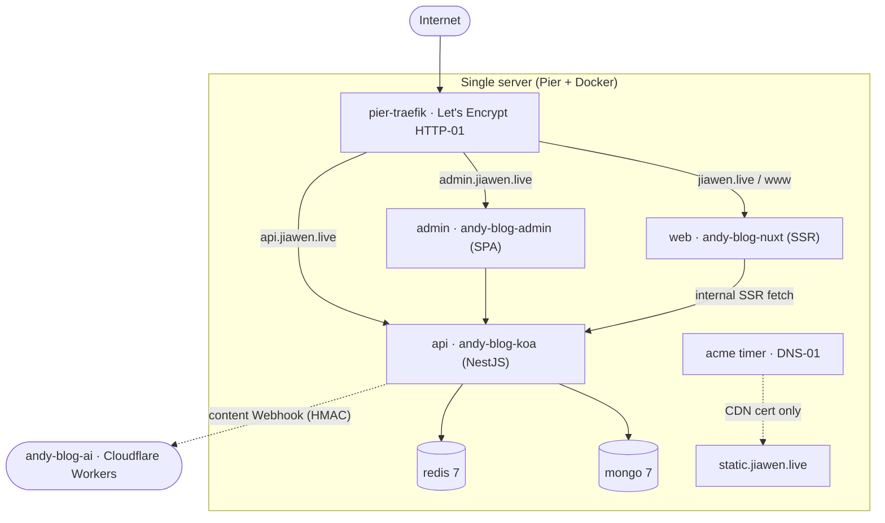

# andy-blog-deploy

[English](./README.md) | [简体中文](./README.zh-CN.md)

Docker Compose orchestration for the **andy-blog** full‑stack personal blog ([jiawen.live](https://jiawen.live)). Locally it is still a one-command Compose stack; production traffic goes through Pier Traefik, and day-to-day releases are rolling image updates from GitHub Actions.

## Architecture


```mermaid
flowchart TD
    Internet(["Internet"]) --> TR

    subgraph Server ["Single server (Pier + Docker)"]
        TR["pier-traefik · Let's Encrypt HTTP-01"]
        TR --> |"jiawen.live / www"| WEB["web · andy-blog-nuxt (SSR)"]
        TR --> |"admin.jiawen.live"| ADMIN["admin · andy-blog-admin (SPA)"]
        TR --> |"api.jiawen.live"| API["api · andy-blog-koa (NestJS)"]
        WEB --> |"internal SSR fetch"| API
        ADMIN --> API
        API --> MONGO[("mongo 7")]
        API --> REDIS[("redis 7")]
        ACME["acme timer · DNS-01"] -.-> |"CDN cert only"| CDN["static.jiawen.live"]
    end

    API -.-> |"content Webhook (HMAC)"| AI(["andy-blog-ai · Cloudflare Workers"])
```

### Services

| Service   | Image / Source                         | Role                                                                 |
| --------- | -------------------------------------- | -------------------------------------------------------------------- |
| `pier-traefik` | Traefik installed by Pier           | Production entry point. Domain routing + Let's Encrypt HTTP-01. The old `gateway` is rollback-only. |
| `web`     | [`andy-blog-nuxt`](https://github.com/zzlw/andy-blog-nuxt)   | SSR blog front end (Nuxt).               |
| `admin`   | [`andy-blog-admin`](https://github.com/zzlw/andy-blog-admin) | Admin dashboard SPA (React + Ant Design).|
| `api`     | [`andy-blog-koa`](https://github.com/zzlw/andy-blog-koa)     | REST API (NestJS) — CMS core.            |
| `mongo`   | `mongo:7`                              | Primary database.                                                    |
| `redis`   | `redis:7-alpine`                       | Cache / sessions.                                                    |
| `acme`    | `./acme` (acme.sh + Aliyun CLI)        | **CDN only**: DNS‑01 renew via a systemd timer. Origin certs come from Traefik. |
| `minio`   | `minio/minio` *(dev only)*             | Local S3‑compatible object storage (replaces Aliyun OSS / R2 in dev).|

The optional [`andy-blog-ai`](https://github.com/zzlw/andy-blog-ai) edge AI service is **not** part of this compose stack (it runs on Cloudflare Workers); the API only pushes content‑change webhooks to it.

## Compose layering

The stack is split into three files so the same topology serves both dev and prod:

| File                          | When                          | Purpose                                                                 |
| ----------------------------- | ----------------------------- | ----------------------------------------------------------------------- |
| `docker-compose.yml`          | always                        | Environment‑agnostic service topology.                                  |
| `docker-compose.override.yml` | dev (auto‑applied)            | Source bind‑mounts + hot reload, local MinIO, exposed debug ports.      |
| `docker-compose.prod.yml`     | prod (explicit `-f`)          | `restart: always`, the `gateway` + `acme` services, no direct port exposure. |

## Configuration

Environment variables are layered the same way; **secrets never live in the repo**:

| File                            | Committed? | Contents                                                          |
| ------------------------------- | ---------- | ----------------------------------------------------------------- |
| `.env.development`              | ✅ yes      | Non‑sensitive dev defaults (points at the local MinIO container). |
| `.env.production`               | ✅ yes      | Non‑sensitive production config (domains, image registry, site).  |
| `.env.production.local`         | ❌ no (gitignored) | All secrets — lives only on the server, `chmod 600`.       |
| `.env.production.local.example` | ✅ yes      | Template for the file above.                                       |

A `gitleaks` GitHub Action scans every push/PR (full history) to keep credentials out of the repo.

## Quick start (local development)

Requires Docker + Docker Compose. The application repos (`andy-blog-koa`, `andy-blog-nuxt`, `andy-blog-admin`) are expected to sit next to this one (`../andy-blog-*`), since dev builds from local source.

```bash
make dev          # build + start everything with hot reload
make dev-build    # same, but refresh images/anonymous volumes after dependency changes
make down         # stop
make clean        # stop AND delete data volumes (mongo / redis / minio)
```

Dev endpoints:

| URL                       | Service                |
| ------------------------- | ---------------------- |
| http://localhost:3001     | Blog front end (web)   |
| http://localhost:3002     | Admin dashboard        |
| http://localhost:3000     | API                    |
| http://localhost:9001     | MinIO console          |
| `localhost:27017 / :16379`| MongoDB / Redis        |

## Production deployment

### Server bootstrap (one time)

```bash
git clone https://github.com/zzlw/andy-blog-deploy /opt/andy-blog
cd /opt/andy-blog
cp .env.production.local.example .env.production.local   # fill in real secrets
chmod 600 .env.production.local
docker login <your-registry>

# Production compose is docker-compose.pier.yml, with Pier owning :80/:443.
# Do not `up` the old docker-compose.prod.yml stack (it will fight Traefik).
make prod
```

Origin HTTPS is renewed by Pier Traefik (HTTP-01). The CDN cert for `static.jiawen.live` still uses acme.sh DNS-01, driven by the host timer `andy-blog-acme-cdn.timer`.

Do not click Redeploy / From Git on the `andy-blog` stack in the Pier UI. Day-to-day releases use CI below.

### Day‑to‑day deploys (CI/CD)

Application repos build and push images in their own CI, then fire a `repository_dispatch` at this repo. The [`Deploy`](.github/workflows/deploy.yml) workflow SSHes into the server, runs `git pull`, and performs a rolling update via [`scripts/deploy.sh`](scripts/deploy.sh):

```bash
sh scripts/deploy.sh api sha-1a2b3c4   # deploy a specific build (also used to roll back)
sh scripts/deploy.sh all latest        # update everything to latest
```

The deployed tag is persisted into `.env.production.local`, so a plain `make prod` always stays on the currently deployed version.

Required GitHub Secrets for the deploy workflow: `SSH_HOST`, `SSH_USER`, `SSH_KEY`.

## HTTPS / certificates

Origin hostnames (`jiawen.live` / `www` / `api` / `admin` / `pier`) are renewed by Traefik Let's Encrypt **HTTP-01**.

`static.jiawen.live` still uses [acme.sh](https://github.com/acmesh-official/acme.sh) **Aliyun DNS‑01**. Renewal only pushes the cert to CDN; it is no longer installed into Nginx.

```bash
make cert-issue        # first CDN wildcard issuance
make cert-renew        # run acme.sh --cron once
make cert-deploy-cdn   # re-push the current cert to the CDN domain
```

## Make targets

| Target            | Description                                                       |
| ----------------- | ----------------------------------------------------------------- |
| `dev` / `dev-build` | Start dev stack (with hot reload).                              |
| `rebuild`         | Recreate containers + no‑cache rebuild (keeps data volumes).      |
| `reset`           | ⚠️ Rebuild **and wipe** all data volumes.                         |
| `down` / `clean`  | Stop / stop + delete data volumes.                                |
| `prod` / `prod-down` | Start / stop the Pier production stack (`docker-compose.pier.yml`). |
| `prod-reload`     | Only useful after rolling back to Nginx; Traefik is the current edge. |
| `cert-*`          | Certificate issuance / renewal / CDN deploy.                      |
| `logs`            | Tail logs from all services.                                      |

## Related repositories

- [andy-blog-koa](https://github.com/zzlw/andy-blog-koa) — REST API (NestJS), CMS core
- [andy-blog-nuxt](https://github.com/zzlw/andy-blog-nuxt) — SSR blog front end
- [andy-blog-admin](https://github.com/zzlw/andy-blog-admin) — admin dashboard SPA
- [andy-blog-ai](https://github.com/zzlw/andy-blog-ai) — edge AI assistant (Cloudflare Workers, RAG + Agent)

## License

[MIT](./LICENSE) © Gavin
