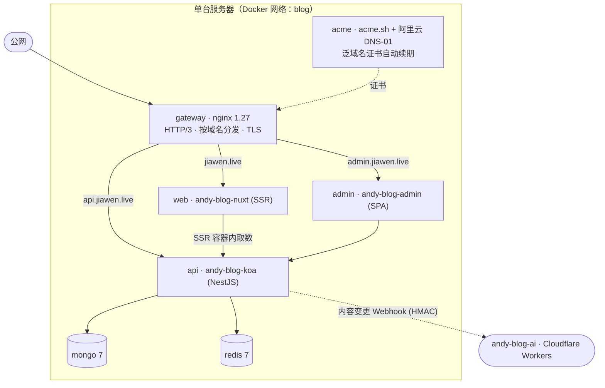

# andy-blog-deploy

[English](./README.md) | [简体中文](./README.zh-CN.md)

**andy-blog** 全栈个人博客（[jiawen.live](https://jiawen.live)）的 Docker Compose 部署编排仓库。一套配置同时支持：本地一键拉起完整平台，以及在单台服务器上带 HTTPS、Nginx 网关、CI/CD 驱动的零停机滚动更新的生产部署。

## 架构



### 服务一览

| 服务      | 镜像 / 来源                            | 职责                                                       |
| --------- | -------------------------------------- | ---------------------------------------------------------- |
| `gateway` | `nginx:1.27-alpine`                    | 统一入口。按域名分发、TLS、HTTP/3 (QUIC)。                 |
| `web`     | [`andy-blog-nuxt`](https://github.com/zzlw/andy-blog-nuxt)   | 博客前台 SSR（Nuxt）。              |
| `admin`   | [`andy-blog-admin`](https://github.com/zzlw/andy-blog-admin) | 后台管理 SPA（React + Ant Design）。|
| `api`     | [`andy-blog-koa`](https://github.com/zzlw/andy-blog-koa)     | REST API（NestJS）— CMS 核心。      |
| `mongo`   | `mongo:7`                              | 主数据库。                                                 |
| `redis`   | `redis:7-alpine`                       | 缓存 / 会话。                                              |
| `acme`    | `./acme`（acme.sh + 阿里云 CLI）       | DNS‑01 泛域名证书签发与自动续期。                          |
| `minio`   | `minio/minio`（仅开发）                | 本地 S3 兼容对象存储（开发环境替代阿里云 OSS / R2）。      |

可选的边缘 AI 服务 [`andy-blog-ai`](https://github.com/zzlw/andy-blog-ai) **不在**本 compose 栈内（它跑在 Cloudflare Workers 上），API 只是向它推送内容变更的 webhook。

## Compose 分层

拓扑拆成三个文件，让同一套定义同时服务开发与生产：

| 文件                          | 何时生效              | 作用                                                          |
| ----------------------------- | --------------------- | ------------------------------------------------------------- |
| `docker-compose.yml`          | 始终                  | 环境无关的服务拓扑。                                          |
| `docker-compose.override.yml` | 开发（自动叠加）      | 源码 bind‑mount + 热重载、本地 MinIO、暴露调试端口。          |
| `docker-compose.prod.yml`     | 生产（显式 `-f` 指定）| `restart: always`、`gateway` 与 `acme` 服务、不直接暴露端口。  |

## 配置

环境变量同样分层，**密钥永不进仓库**：

| 文件                            | 是否提交 | 内容                                                       |
| ------------------------------- | -------- | ---------------------------------------------------------- |
| `.env.development`              | ✅ 是     | 非敏感开发默认值（指向本地 MinIO 容器）。                  |
| `.env.production`               | ✅ 是     | 非敏感生产配置（域名、镜像仓库、站点信息）。              |
| `.env.production.local`         | ❌ 否（已忽略） | 全部密钥 — 只存服务器，`chmod 600`。               |
| `.env.production.local.example` | ✅ 是     | 上面那个文件的模板。                                       |

仓库配有 `gitleaks` GitHub Action，对每次 push/PR（含完整历史）扫描，防止凭证被提交。

## 快速开始（本地开发）

需要 Docker + Docker Compose。应用仓库（`andy-blog-koa`、`andy-blog-nuxt`、`andy-blog-admin`）需与本仓库平级放置（`../andy-blog-*`），因为开发态从本地源码构建。

```bash
make dev          # 构建并热重载启动全部服务
make dev-build    # 同上，但在依赖变更后刷新镜像/匿名卷
make down         # 停止
make clean        # 停止并删除数据卷（mongo / redis / minio）
```

开发端口：

| 地址                       | 服务                |
| ------------------------- | ------------------- |
| http://localhost:3001     | 博客前台（web）      |
| http://localhost:3002     | 后台管理            |
| http://localhost:3000     | API                 |
| http://localhost:9001     | MinIO 控制台        |
| `localhost:27017 / :16379`| MongoDB / Redis     |

## 生产部署

### 服务器初始化（一次性）

```bash
git clone https://github.com/zzlw/andy-blog-deploy /opt/andy-blog
cd /opt/andy-blog
cp .env.production.local.example .env.production.local   # 填入真实密钥
chmod 600 .env.production.local
docker login <你的镜像仓库>                                # 以便拉取镜像

make cert-selfsigned   # 自签占位证书，让 nginx :443 能冷启动
make prod              # 拉镜像 + 启动完整生产栈
make cert-issue        # 签发真正的 Let's Encrypt 泛域名证书（DNS-01）
make prod-reload       # 用真证书重载 nginx
```

之后 `acme` 容器每天检查、到期前约 30 天自动续期；网关每 6 小时自动 reload，续期证书无需人工干预即可生效。

### 日常部署（CI/CD）

应用仓库在各自 CI 里构建并推送镜像，随后向本仓库发起 `repository_dispatch`。[`Deploy`](.github/workflows/deploy.yml) 工作流 SSH 到服务器、执行 `git pull`，再通过 [`scripts/deploy.sh`](scripts/deploy.sh) 做滚动更新：

```bash
sh scripts/deploy.sh api sha-1a2b3c4   # 部署指定版本（也用于回滚）
sh scripts/deploy.sh all latest        # 全部更新到 latest
```

部署的 tag 会持久化写入 `.env.production.local`，因此直接 `make prod` 始终保持在当前已部署版本。

部署工作流所需的 GitHub Secrets：`SSH_HOST`、`SSH_USER`、`SSH_KEY`。

## HTTPS / 证书

TLS 由 `acme` 服务（[acme.sh](https://github.com/acmesh-official/acme.sh)）通过**阿里云 DNS‑01** 验证完成，签发一张覆盖 `BASE_DOMAIN` 与 `*.BASE_DOMAIN`（前台、`api`、`admin`、`static`）的泛域名证书。续期后会自动把证书重装进网关，并推送到 CDN/静态域名。

```bash
make cert-issue        # 首次签发
make cert-renew        # 强制续期（一般自动完成）
make cert-deploy-cdn   # 把当前证书重新推送到 CDN 域名
```

## Make 命令

| 命令              | 说明                                              |
| ----------------- | ------------------------------------------------- |
| `dev` / `dev-build` | 启动开发栈（热重载）。                          |
| `rebuild`         | 重建容器 + 无缓存重建（保留数据卷）。            |
| `reset`           | ⚠️ 重建**并清空**所有数据卷。                     |
| `down` / `clean`  | 停止 / 停止并删除数据卷。                         |
| `prod` / `prod-down` | 启动 / 停止生产栈。                            |
| `prod-reload`     | 平滑重载 nginx（不中断连接）。                   |
| `cert-*`          | 证书签发 / 续期 / 推送 CDN。                      |
| `logs`            | 跟踪全部服务日志。                                |

## 关联仓库

- [andy-blog-koa](https://github.com/zzlw/andy-blog-koa) — REST API（NestJS），CMS 核心
- [andy-blog-nuxt](https://github.com/zzlw/andy-blog-nuxt) — 博客前台 SSR
- [andy-blog-admin](https://github.com/zzlw/andy-blog-admin) — 后台管理 SPA
- [andy-blog-ai](https://github.com/zzlw/andy-blog-ai) — 边缘 AI 助手（Cloudflare Workers，RAG + Agent）

## 许可证

[MIT](./LICENSE) © Gavin
